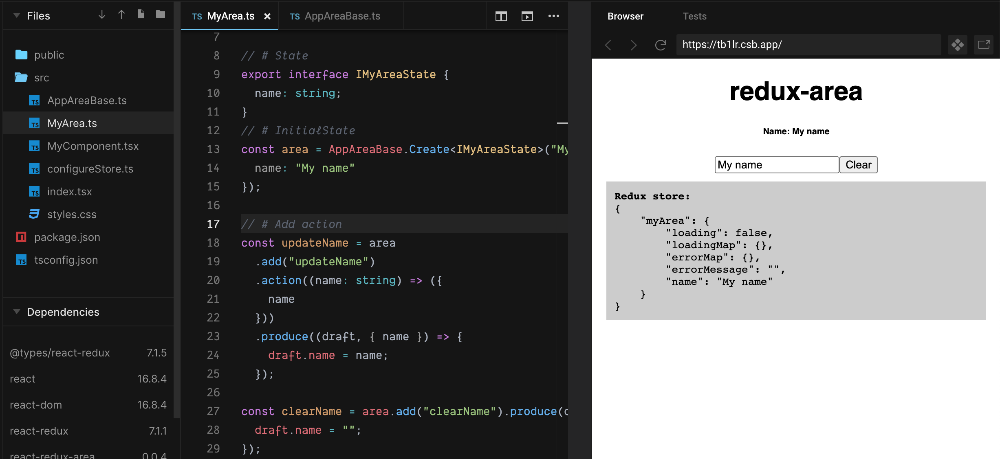

# React-redux-area

**Short:** `Simplified strongly typed redux` (React specific methods)

Sub module for Redux-area with react specific method.

**react-redux-area**

[react-redux-area on npmjs](https://www.npmjs.com/package/react-redux-area)

[react-redux-area github](github.com/alfnielsen/react-redux-area)

**redux-area**

[redux-area on npmjs](https://www.npmjs.com/package/redux-area)

[redux-area github](github.com/alfnielsen/redux-area)

[redux-area documentation (github wiki)](https://github.com/alfnielsen/redux-area/wiki)

## React method added:

This modules add react specific functionality to [Redux-area](https://www.npmjs.com/package/redux-area)

- CreateAreaHook
- CreateDispatchAction (It is recommended not to use - Used internally in CreateDispatchActionsObject)
- CreateDispatchActionsObject

This is a base example for a redux-area `userArea` (All of this is without use of react)

```ts
// Define global area in for your redux store:
// export interface IReduxState { user: IUserAreaState }
// Define area state interface:
export interface IUserAreaState {
   currentUser?: IUser
}
// To define area factory like `AppAreaBase` see Redux-area docs.
const area = AppAreaBase<IUserAreaState>({})
// add fetch method (4 actions: request, success, failure, clear)
export const loadUser = area.addFetch("loadUser")
   .action((id:number)=>({id}))
   .successProduce((draft, {user}) => {
      draft.currentUser = user;
   })
   .clearProduce(draft => {
      draft.currentUser = undefined;
   })
   .baseFailure()
// add single action
export const renameUser = area.add("renameUser")
   .action((name:string) => ({name}))
   .produce((draft, {name}) => {
      drat.currentUser.name = name
   })

const userActions = {
   load: loadUser.request
   clear: loadUser.clear
   rename: renameUser
}

export const UserReducers = area.rootReducer()

```

After this the examples uses react-redux-area and react specific functionality.

### CreateAreaHook

Takes action from an area and a selector and create an area hook.

This is a wrap of CreateDispatchActionsObject and a selector to make an easy hook.

Often its better to define the hook your self, if you want to export methods that should not be dispatch,
like an Equal method ect..

```tsx
// Uses ex: (Add this line in the area file)
const useUser = () =>
  CreateAreaHook(userActions, (state: IReduxStore) => state.user)
```
 Uses in component:
```tsx
const UserDetails: FC = () => {
  const { currentUser: user, rename } = useUser()
  return (
    <div>
      <b>
        {user.name} ({user.age})
      </b>
      Rename: <input
        value={user.name}
        onChange={(e) => {
          rename(e.target.value)
        }}
      />
    </div>
  )
}
```
Actual implementation: Copy if custom hook is needed (you don't need the generic for your copy)

```ts
export const CreateAreaHook = <
  T extends MapMethodWithActionName<T>,
  TReduxStoreState,
  TAreaState
>(
  areaActions: T,
  selector: (state: TReduxStoreState) => TAreaState
) => {
  const areaState = useSelector(selector)
  const dispatchActions = CreateDispatchActionsObject(areaActions)
  return {
    ...areaState,
    ...dispatchActions,
  }
}
```

#### CreateDispatchAction

> **it is recommended to** create a AreaHook and only use that. 

Use this or `CreateDispatchActionsObject` in the hook

**NOTE** This will not memorize the new dispatch action

**It is recommended to** use `CreateDispatchActionsObject` instead which will memories the map it creates.

Takes an `Action` created from `area.add` or `area.addFetch` and create a dispatch version of it.

It will take your method and wrap it in a dispatch.
It will also add `actionName` and `name` from the `Action`

> The `actionName` is shared by all 4 action for an addFetch, and can be use the track loading ect.

#### CreateDispatchActionsObject

Takes an an map of `Action` and create a new map of dispatch version.

Uses `CreateDispatchAction`.

This memorize the new map that all method a safe to use in react dependency array for effect and other hooks.

```tsx
// It is recommended to only use this is an area hook (This is just show how it works)
export const UserActions = CreateDispatchActionsObject(areaActions)

// Uses in component:
const UserDetails: FC<{ name: string }> = ({ name }) => {
  const { rename } = UserActions()
  return (
    <div>
      Rename:{" "}
      <input
        value={name}
        onChange={(e) => {
          rename(e.target.value)
        }}
      />
    </div>
  )
}
```

## Install

```sh
npm install react-redux-area
```

Or

```sh
yarn add react-redux-area
```

## Demo

_(editable codesandbox.io)_

Demo: [Demo in React](https://codesandbox.io/s/redux-area-base-ex-tb1lr?fontsize=14&hidenavigation=1&theme=dark)

[](https://codesandbox.io/s/redux-area-base-ex-tb1lr?fontsize=14&hidenavigation=1&theme=dark)
